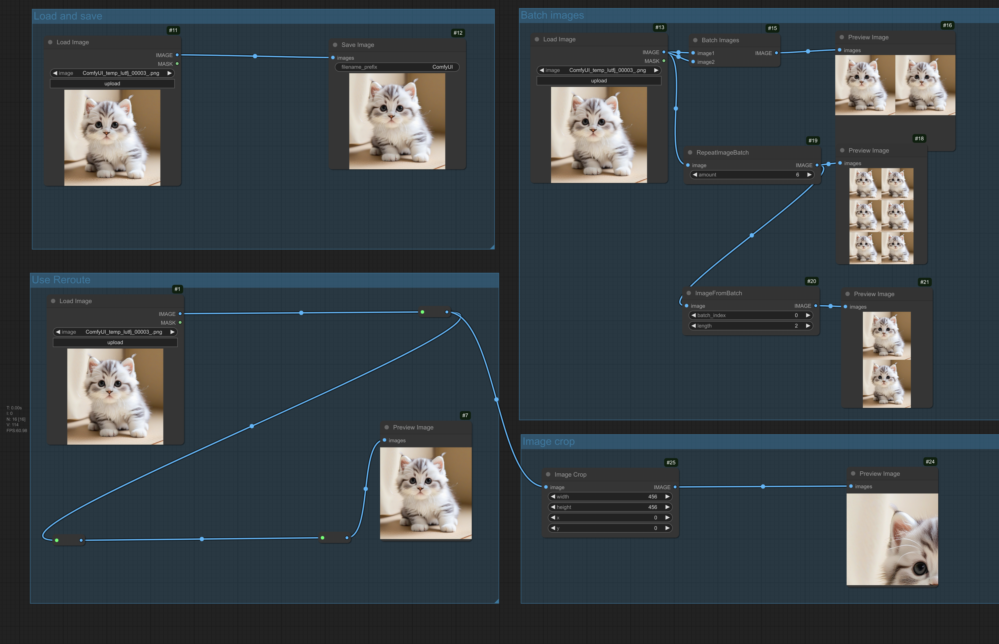
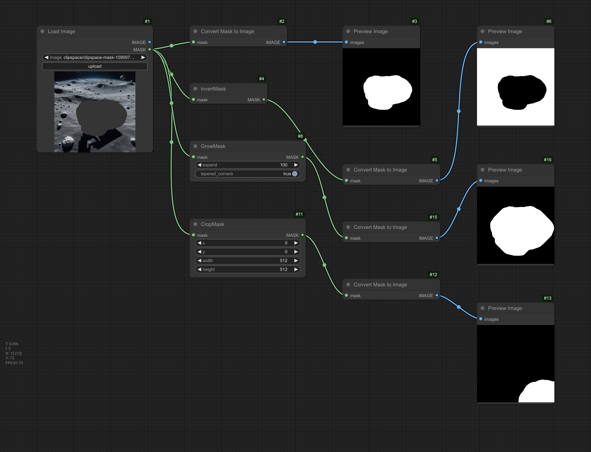
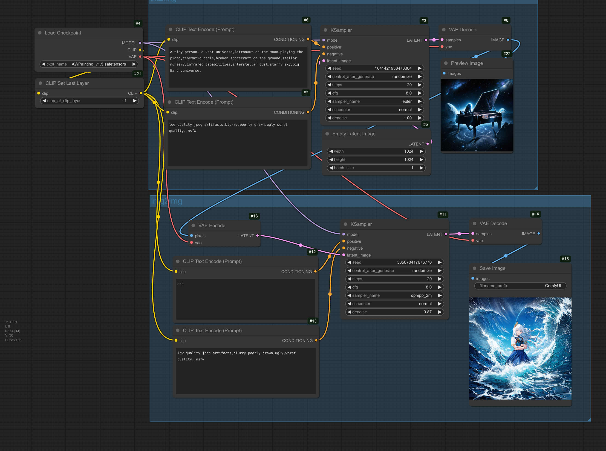
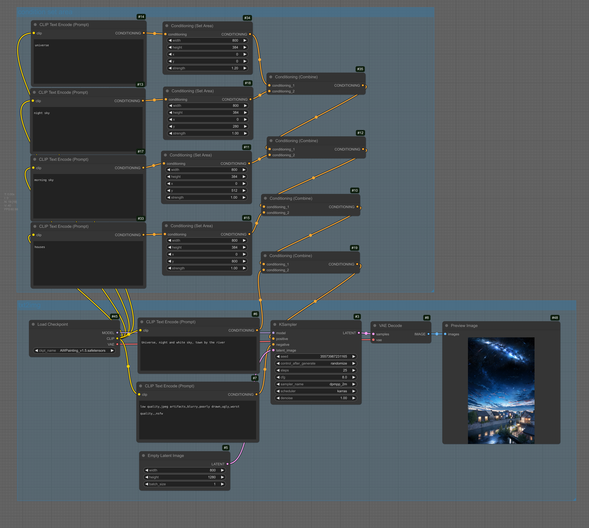
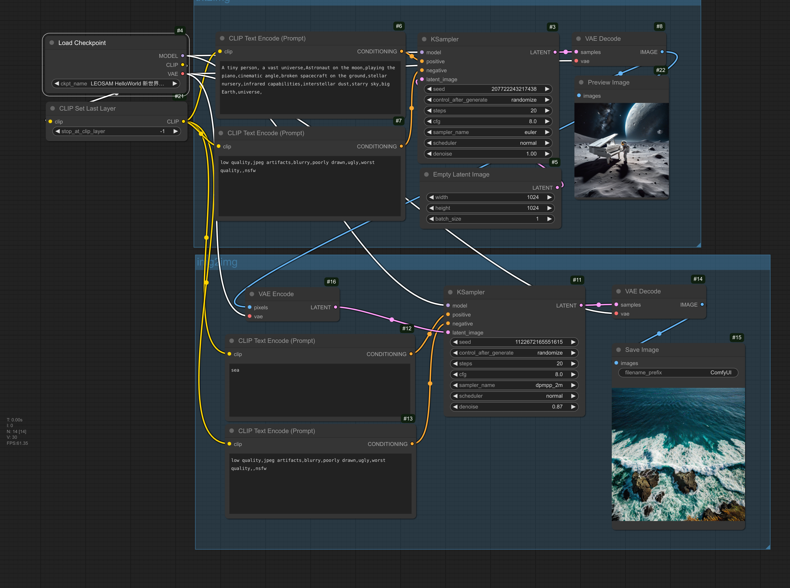
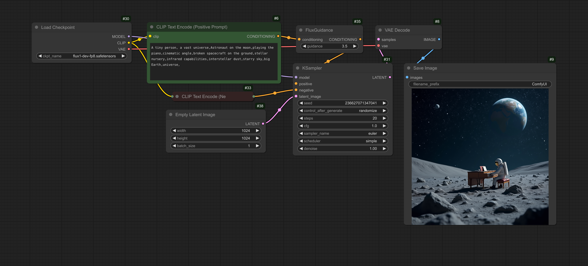
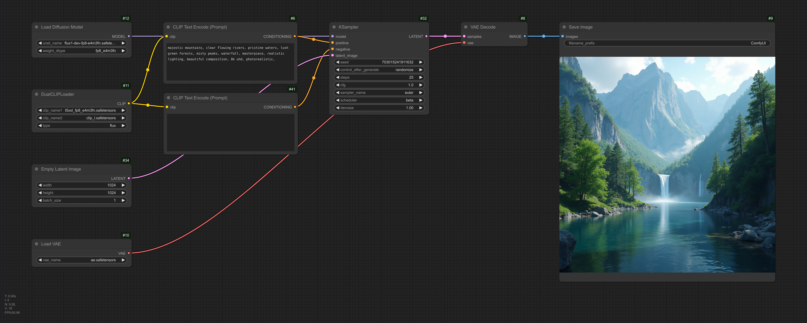
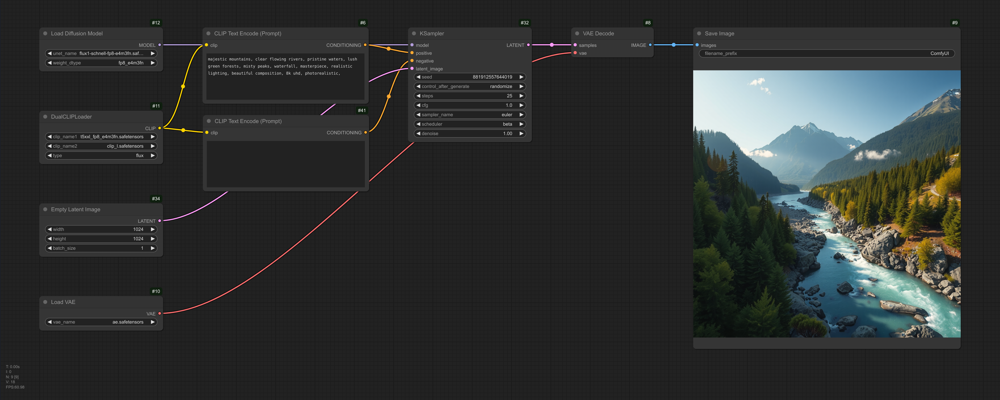
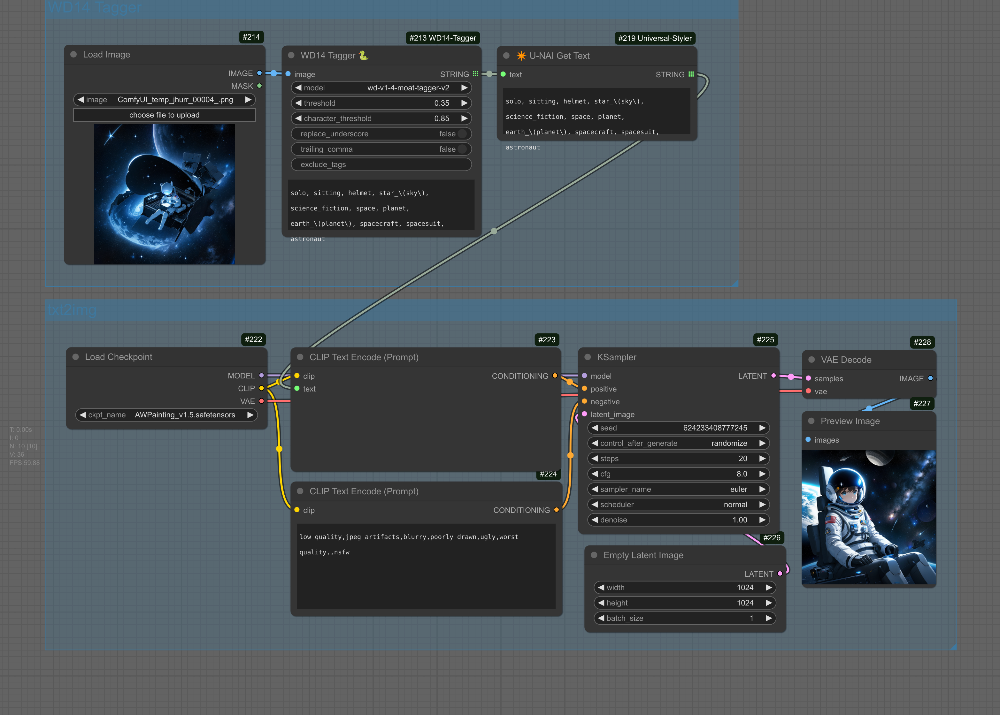
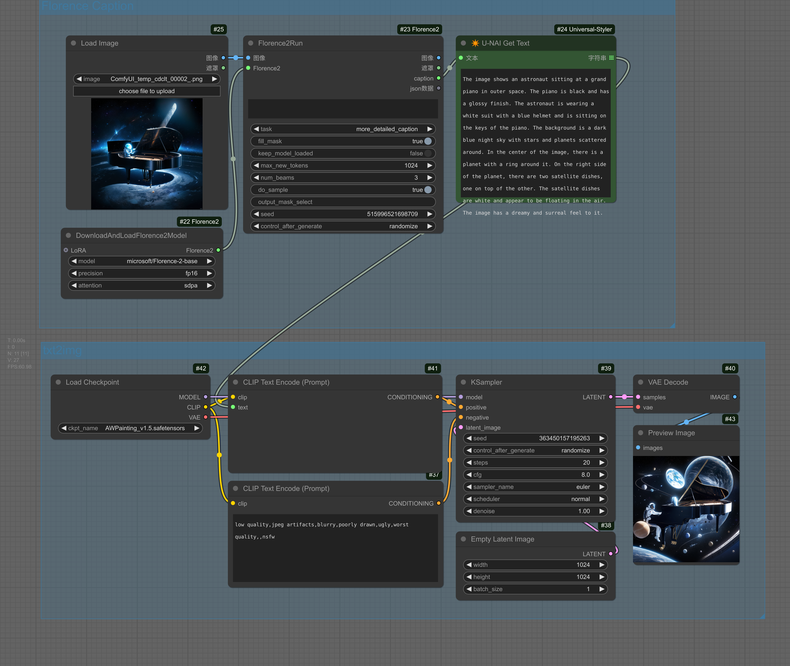

# ComfyUI-Workflow-Sanbu

<b>散步的 ComfyUI 工作流合集 | Sanbu's ComfyUI Workflow Collection</b>

  

包含自制与转发 Comfyui 工作流，转发部分会注明原作者及其对应仓库出处。
如有帮助欢迎 star，加快合集更新。

## 快速开始

ComfyUI 下载：git clone <https://github.com/comfyanonymous/ComfyUI.git>

Comfyui 管理器下载：cd custom_nodes && git clone <https://github.com/ltdrdata/ComfyUI-Manager.git>

Comfyui 汉化：cd custom_nodes && git clone <https://github.com/AIGODLIKE/AIGODLIKE-COMFYUI-TRANSLATION.git>  （随后选中页面 setting，AGL，选择中文

- **使用时，将工作流图片拖入 Comfyui 页面即可使用。**
- 运行如果遇到问题，优先更新 Comfyui 查看是否能够解决，不能解决则提交 issue

##  目录 ✨

- [一、基础](#一基础)
  - [基础操作](#基础操作)
  - [图像生成](#图像生成)
    - [SD1.5](#sd15)
    - [SDXL](#sdxl)
    - [Flux](#flux)
    - [SD3.5](#sd35)
- [二、图像标签获取](#二图像标签获取)
- [三、图像放大](#三图像放大)
- [四、图像抠图](#四图像抠图)
- [五、局部修复](#五局部修复)
- [六、图像参考 / 风格转换](#六图像参考--风格转换)
- [其他特殊工作流](#其他特殊工作流)

**其他推荐插件：**

Comfyui 页面查看硬件资源、显卡占用 <https://github.com/crystian/ComfyUI-Crystools>

### 一、基础

#### 基础操作

<b>图片基础操作</b>

- 图片加载后对图片进行 batch 和 crop 操作
- 使用转接点可以无限延展接线

<b>mask 基础操作</b>

- 在图片结点右键，选择遮罩编辑器（MaskEditor）即可进行 mask 绘制；或传入带透明通道图像使用。

#### 图像生成

##### **SD1.5**

测试模型下载：<https://www.liblib.art/modelinfo/1fd281cf6bcf01b95033c03b471d8fd8>

<b>SD1.5 文生图与图生图工作流</b>

- 文生图(txt2img): 通过文字提示词生成图像
- 图生图(img2img): 通过参考图片和文字提示词转换成潜在编码，利用潜在编码生成新的图像
- 使用时更换 checkpoint 为任意 SD1.5 模型

<b>SD1.5 条件 latent 分区域生成</b>

- 使用 Conditioning (Set Area) 结点控制不同区域生成时的条件，根据不同区域的需求得到最后的生成图像

##### **SDXL**

测试模型下载：<https://www.liblib.art/modelinfo/506c46c91b294710940bd4b183f3ecd7>

<b>SDXL 文生图与图生图工作流</b>

- 文生图(txt2img): 通过文字提示词生成图像
- 图生图(img2img): 通过参考图片和文字提示词转换成潜在编码，利用潜在编码生成新的图像
- 使用时更换 checkpoint 为任意 SDXL 模型

turbo 模型

lightning 模型

##### **Flux**

flux models 中存放文件夹对应：

| 下载地址 | 文件夹 |
| --- | --- |
| <https://www.modelscope.cn/models/livehouse/flux1-dev-fp8/resolve/master/flux1-dev-fp8.safetensors> | checkpoint |
| <https://www.modelscope.cn/models/AI-ModelScope/flux-fp8/resolve/master/flux1-dev-fp8-e4m3fn.safetensors> | unet |
| <https://www.modelscope.cn/models/AI-ModelScope/flux-fp8/resolve/master/flux1-schnell-fp8-e4m3fn.safetensors> | unet |
| <https://www.modelscope.cn/models/SilentAfr/flux_clip/resolve/master/clip_l.safetensors> | clip |
| <https://www.modelscope.cn/models/mapjack/Flux_1_fp18/resolve/master/t5xxl_fp8_e4m3fn.safetensors> | clip |
| <https://www.modelscope.cn/models/AI-ModelScope/FLUX.1-dev/resolve/master/ae.safetensors> | vae |

<b>Flux 统一dev fp8 文生图工作流</b>

- 包含了clip和vae的多合一模型

Flux dev 和 schnell 都没有负面提示，因此CFG 应该设置为 1.0，意味着忽略负面提示。

<b>Flux dev fp8 文生图工作流</b>

- clip和unet部分分开下载的模型  

<b>Flux schnell fp8 文生图工作流</b>

##### **SD3.5**

### 二、图像标签获取

<b>wd14 tagger 标签获取工作流</b>

<b>florence caption 标签获取工作流</b>

### 三、图像放大

本地模型放大

### 四、图像抠图

常见抠图模型

SAM

### 五、局部修复

局部重绘

局部修复

面部眼部修复

### 六、图像参考 / 风格转换

sd1.5 ipadapter 参考

sdxl ipadapter 参考

flux redux 参考

### 其他特殊工作流

#### BizyAir

电脑资源不够，可以利用 BizyAir 组件进行0资源生图体验：

<https://github.com/siliconflow/BizyAir>

FLUX 文生图与图生图工作流

captiopn 工作流

### Reference

感谢以下作者网站提供的灵感
