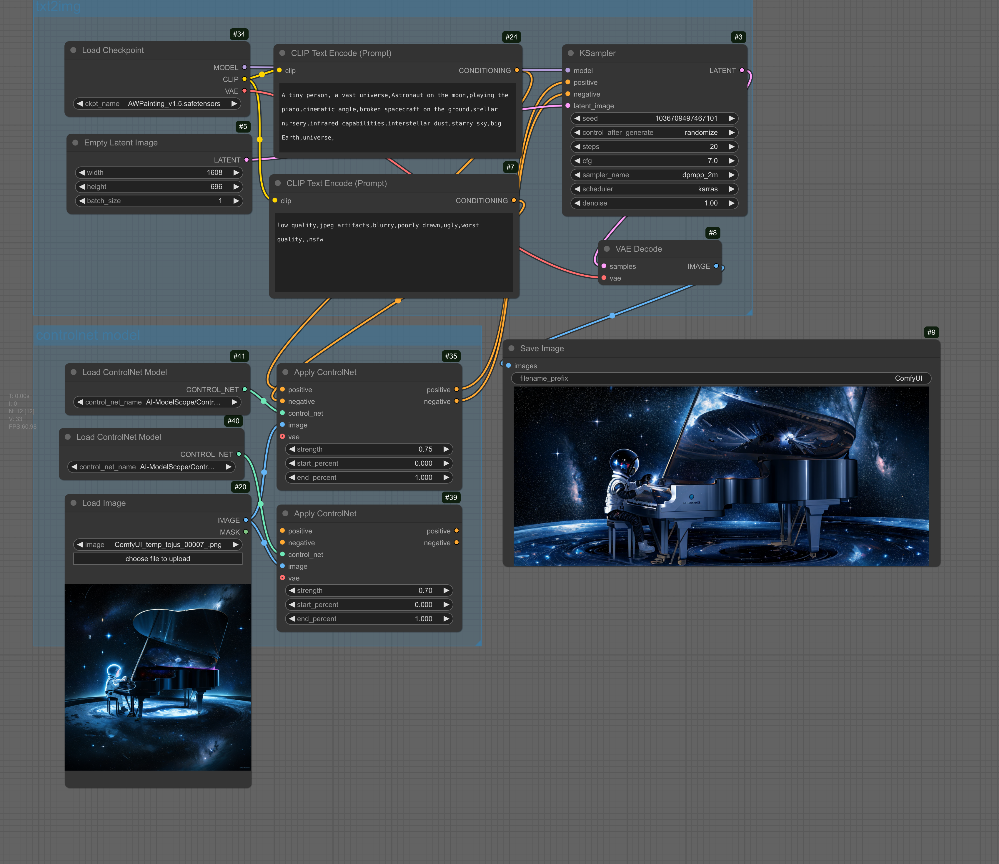

[中文版](README_zh.md)  
[English](README.md)

# ComfyUI-Workflow-Sanbu

<div align="center">

<b>Sanbu's ComfyUI Workflow Collection | 散步的 ComfyUI 工作流合集</b>
</div>

<br><br>

Personal Comfyui workflow, with some parts credited to the original authors and their corresponding repository sources.
If you find it helpful, please star to accelerate the collection updates.

## Quick Start

ComfyUI Download: git clone <https://github.com/comfyanonymous/ComfyUI.git>

Comfyui Manager Download: cd custom_nodes && git clone <https://github.com/ltdrdata/ComfyUI-Manager.git>

Comfyui Chinese Translation: cd custom_nodes && git clone <https://github.com/AIGODLIKE/AIGODLIKE-COMFYUI-TRANSLATION.git>  (then select the page setting, AGL, and choose Chinese

- **To use, simply drag the workflow images into the Comfyui page.**
- If you encounter issues during operation, please update Comfyui first to see if it can be resolved, and if not, submit an issue

## Directory ✨

- [1, Basic](#1-basic)
  - [Basic Operations](#basic-operations)
  - [Image Generation](#image-generation)
    - [SD1.5](#sd15)
    - [SDXL](#sdxl)
    - [Flux](#flux)
    - [SD3.5](#sd35)
- [2, Image Tagging](#2-image-tagging)
- [3, Image Enlargement](#3-image-enlargement)
- [4, Image Segmentation](#4-image-segmentation)
- [5, Local Repair](#5-local-repair)
- [6, Image Reference / Style Transfer](#6-image-reference--style-transfer)
- [Other Special Workflows](#other-special-workflows)

**Other Recommended Plugins:**

Comfyui page to view hardware resources, GPU usage <https://github.com/crystian/ComfyUI-Crystools>

### 1, Basic

#### Basic Operations

<div align="center">

<b>Basic Image Operations</b>
</div>

- Perform batch and crop operations on images after loading
- Use connection points to infinitely extend the wiring

<div align="center">

<b>Mask Basic Operations</b>
</div>

- Right-click on the image node and select the mask editor (MaskEditor) to draw masks; or use images with transparent channels.

<div align="center">

<b>Node Reuse Setting</b>
</div>

- Install the node reuse plugin https://github.com/kijai/ComfyUI-KJNodes
- Create a SetNode node, which can pass in the output of any workflow as a backup, and operate based on the renaming result
- Create a GetNode node, which can obtain the output of the SetNode node based on the renaming result

#### Image Generation

Includes ordinary image generation workflows and conditional control (control network) image generation workflows.

##### **SD1.5**

Model download: <https://www.liblib.art/modelinfo/1fd281cf6bcf01b95033c03b471d8fd8>

<div align="center">

<b>SD1.5 Text-to-Image and Image-to-Image Workflow</b>
</div>

- Text-to-image (txt2img): Generate images based on text prompts
- Image-to-image (img2img): Convert reference images and text prompts into latent codes, and use latent codes to generate new images
- Replace the checkpoint with any SD1.5 model when using

<div align="center">

<b>SD1.5 Conditional Latent Region Generation</b>
</div>

- Use the Conditioning (Set Area) node to control the conditions for different regions during generation, and get the final generated image based on the requirements of different regions

<div align="center">

<b>SD1.5 Control Network Multiple Integrations</b>
</div>

- Download control network weights, and get all models:

```python
from modelscope import snapshot_download
model_dir = snapshot_download('AI-ModelScope/ControlNet-v1-1', cache_dir='./ComfyUI/models/controlnet/')
print('Installation complete')
```

<div align="center">

<b>SD1.5 Control Network Openpose Multiple</b>
</div>

- Can easily use multiple openpose to create stable human poses, test images can be obtained at [this address](https://comfyanonymous.github.io/ComfyUI_examples/controlnet/pose_worship.png)

##### **SDXL**

Model download: <https://www.liblib.art/modelinfo/506c46c91b294710940bd4b183f3ecd7>

<div align="center">

<b>SDXL Text-to-Image and Image-to-Image Workflow</b>
</div>

- Text-to-image (txt2img): Generate images based on text prompts
- Image-to-image (img2img): Convert reference images and text prompts into latent codes, and use latent codes to generate new images
- Replace the checkpoint with any SDXL model when using

turbo model

lightning model

##### **Flux**

flux models folder corresponds to:

| Download URL | Folder |
| --- | --- |
| <https://www.modelscope.cn/models/livehouse/flux1-dev-fp8/resolve/master/flux1-dev-fp8.safetensors> | checkpoint |
| <https://www.modelscope.cn/models/AI-ModelScope/flux-fp8/resolve/master/flux1-dev-fp8-e4m3fn.safetensors> | unet |
| <https://www.modelscope.cn/models/AI-ModelScope/flux-fp8/resolve/master/flux1-schnell-fp8-e4m3fn.safetensors> | unet |
| <https://www.modelscope.cn/models/SilentAfr/flux_clip/resolve/master/clip_l.safetensors> | clip |
| <https://www.modelscope.cn/models/mapjack/Flux_1_fp18/resolve/master/t5xxl_fp8_e4m3fn.safetensors> | clip |
| <https://www.modelscope.cn/models/AI-ModelScope/FLUX.1-dev/resolve/master/ae.safetensors> | vae |

<div align="center">

<b>Flux Unified Dev FP8 Text-to-Image Workflow</b>
</div>

- Includes a single model that combines clip and vae

Flux dev and schnell do not have negative prompts, so the CFG should be set to 1.0, meaning to ignore negative prompts.

<div align="center">

<b>Flux Dev FP8 Text-to-Image Workflow</b>
</div>

- Clip and unet parts are downloaded separately

<div align="center">

<b>Flux Schnell FP8 Text-to-Image Workflow</b>
</div>

##### **SD3.5**

Model download address <https://www.modelscope.cn/models/cutemodel/comfyui-sd3.5-medium>

<div align="center">

<b>SD3.5 FP8 Text-to-Image Workflow</b>
</div>

- Can use either a single text encoder or three text encoders

### 2, Image Tagging

<div align="center">

<b>wd14 Tagger Tagging Workflow</b>
</div>

<div align="center">

<b>Florence Caption Tagging Workflow</b>
</div>

### 3, Image Enlargement

- Model file reference download <https://www.modelscope.cn/models/cutemodel/Resolution-model/files>
- Model files are placed in the models/upscale_models directory

<div align="center">

<b>Super Resolution Image Enlargement</b>
</div>

<div align="center">

<b>Resize Latent Scaling Image Enlargement</b>
</div>

### 4, Image Segmentation

<div align="center">

<b>ClipSeg Segmentation</b>
</div>
- Using clipseg, we can segment expected regions using natural language, this supports outputting soft and hard edge masks
- Can directly clone the repository to custom_nodes and run it directly: https://github.com/sanbuphy/ComfyUI-CLIPSEG

SAM

### 5, Local Repair and Expansion

Local Redrawing

Local Repair

Facial Eye Repair

Image Expansion

### 6, Image Reference / Style Transfer

sd1.5 ipadapter reference

sdxl ipadapter reference

flux redux reference

### Other Special Workflows

#### BizyAir

If your computer resources are insufficient, you can use the BizyAir component for 0-resource image generation experience:

<https://github.com/siliconflow/BizyAir>

FLUX Text-to-Image and Image-to-Image Workflow

captiopn Workflow

### Reference

Thanks to the following authors' websites for inspiration

Comfyui Official Tutorial: <https://comfyanonymous.github.io/ComfyUI_examples/>